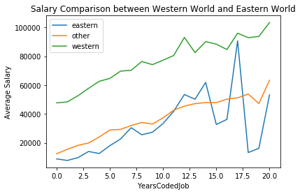
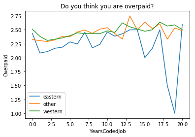
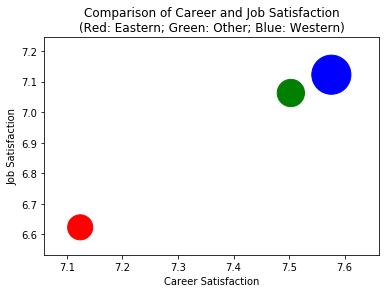

### Introduction
There are many competing views when it comes to the IT career in the eastern world, specifically if you are a Software Engineer or so-called Coding Monkey.

You may have heard statements like “you need to go to Silicon Valley” or “don’t stay in the east if you are a Software Engineer.”

# Part I: Should you find a job in the Western World?
But the question I was most interested in was
> “Let’s pretend you have a distant cousin. They are 24 years old, have a college degree in computer programming, and have been working a coding job for the last two years in China. They want your advice on should they switch to a career in America. How would you recommend to your cousin?”

Here you can see a programmer’s salary in the east is much lower than that in the west no matter how many years you are coding.

The data here are actual salary overall developers in the survey, but it could be more interesting to know how the difference of job satisfaction, career satisfaction and salary between East and West.

# Part II: How do you think of your salary?
In the chart below, I was interested in how the developers think about their salary, is it underpaid or overpaid. The lines represent how they think they are overpaid, with a higher mark indicates the more they think they are overpaid.

You can see that eastern programmers (blue line) feel more underpaid in their whole careers than western programmers (green line)

# Part III: What is the Job and Career Satisfaction difference?

Here, we can see that western programmers (blue ball) have a much higher satisfaction on their job and career, positioned at the right-high-up corner.
The ball size indicator their average salary, the blue ball size is much larger than the red ball (eastern programmers salary).

### Conclusion
In this article, we took a look at why switch your career to the western world if you live in the east according to Stack Overflow 2017 survey data.

1. We compared the salary based on Years a programmer has been coded between the eastern world and the western world. We found that the salary of an eastern programmer is much lower than that of the western no matter how many years they are coded.

2. We then looked at how different between the viewpoints that both west and east think if they are underpaid. This showed that more eastern programmers always think that they are underpaid than the western programmers no matter how many years they are coded.

3. Finally, we found that the Career and Job Satisfaction of the western programmers are much higher than those of the eastern programmers.

The findings here are observational, not the result of a formal study. So the real question remains:

> Will you go to the west?

To see more about this analysis, see the link to my Github available [here](https://github.com/joshuayeung/Write-A-Data-Science-Blog-Post/blob/master/Write%20a%20Data%20Science%20Blog%20Post.ipynb).
